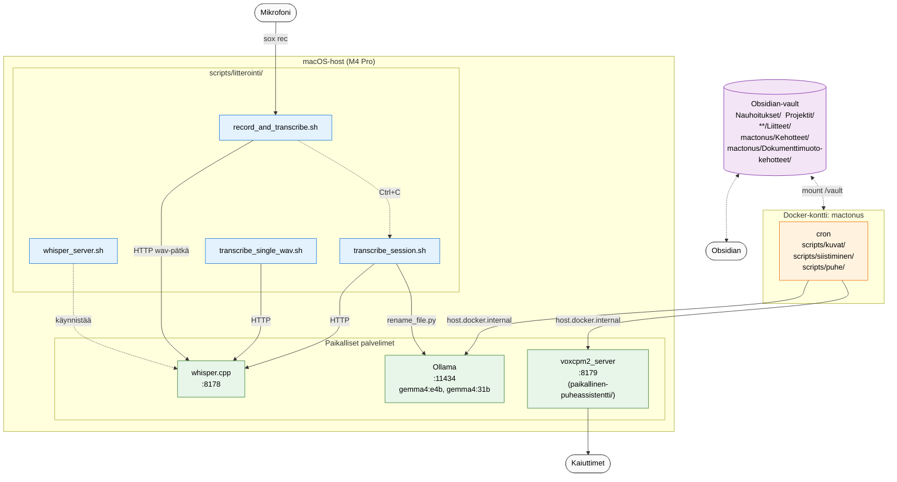
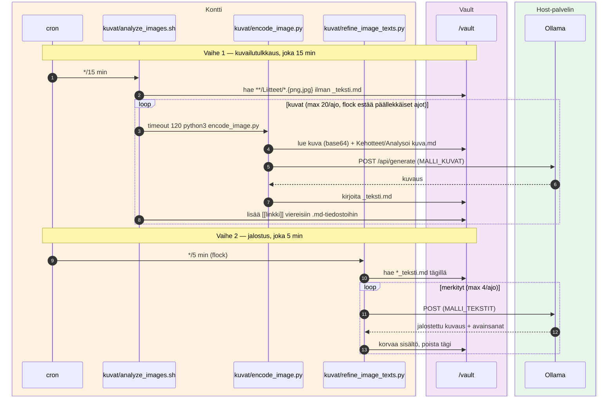
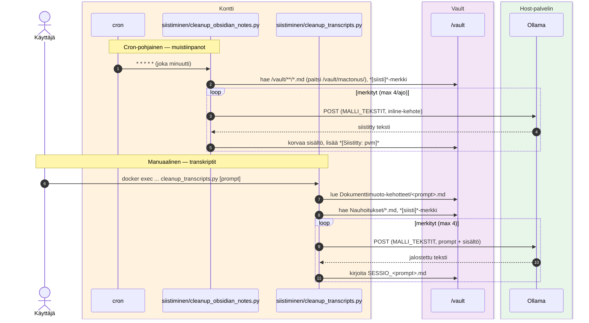
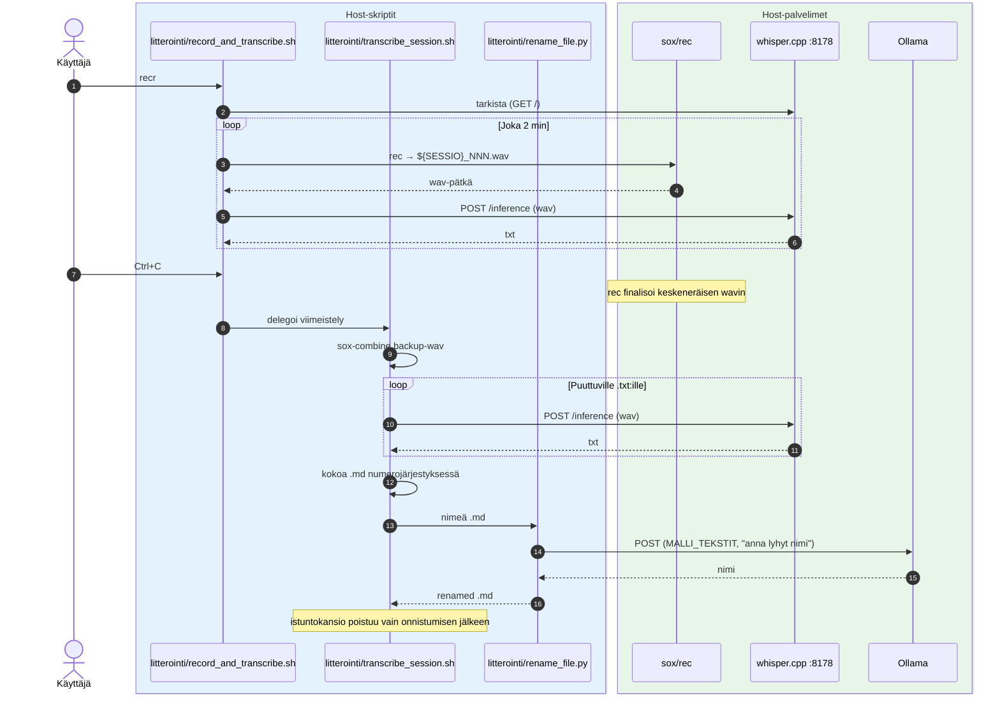
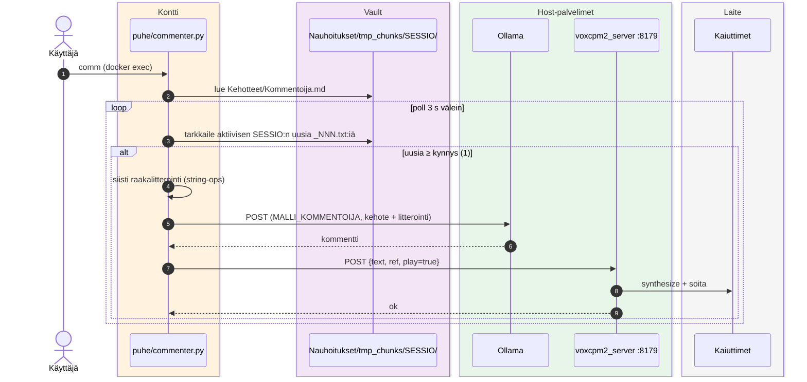

# Mactonus

Paikallinen AI-putki Obsidian-vaultille. Automatisoi muistiinpanojen, äänitallenteiden ja kuvien käsittelyn hyödyntäen **paikallisia** malleja — ei pilveä, ei API-avaimia, ei dataa ulos. Lisäksi reaaliaikainen ääniagentti seuraa käynnissä olevaa nauhoitusistuntoa ja kommentoi sitä puheella. Kaikki LLM-, litterointi- ja TTS-inferenssi pyörii hostilla Metal-kiihdytyksellä.

## Yleisarkkitehtuuri



**Keskeinen periaate:** Ollama, whisper.cpp ja VoxCPM2 pyörivät **hostilla**, eivät kontissa, koska Docker Desktop ei läpäise Metal-GPU:ta. Kontissa pyörii vain orkestrointi (cron + Python). Konttisisäiset skriptit kutsuvat hostin palveluja `host.docker.internal`-osoitteen kautta.

## Työnkulut

| Työnkulku | Laukaisin | Skripti(t) | Malli | Syöte → Tuloste |
|---|---|---|---|---|
| Nauhoitus + litterointi | manuaalinen (host) | `litterointi/record_and_transcribe.sh` + `transcribe_session.sh` | whisper large-v3-turbo | mikki → `.md` Obsidianiin |
| Yksittäinen wav | manuaalinen (host) | `litterointi/transcribe_single_wav.sh` | whisper large-v3-turbo | `.wav` → `.txt` |
| Kuva-analyysi | cron 15 min (kontti) | `kuvat/analyze_images.sh` → `encode_image.py` | `MALLI_KUVAT` | kuva `**/Liitteet/`:ssä → `*_teksti.md` + linkit viereisiin md-tiedostoihin |
| Kuvatekstien jalostus | cron 5 min (kontti) | `kuvat/refine_image_texts.py` | `MALLI_TEKSTIT` | `*_teksti.md` joissa `#siisti-kuvailutulkkaus` → siistitty kuvaus + avainsanat |
| Obsidian-notejen siistiminen | cron 1 min (kontti) | `siistiminen/cleanup_obsidian_notes.py` | `MALLI_TEKSTIT` | `*[siisti]*`-merkitty `.md` → korvattu sisältö |
| Transkriptien siistiminen | manuaalinen (kontti) | `siistiminen/cleanup_transcripts.py [prompt]` | `MALLI_TEKSTIT` | `*[siisti]*`-merkitty `Nauhoitukset/*.md` + valittu prompt → `*_<prompt>.md` |
| Kommentointi | manuaalinen (kontti) | `puhe/commenter.py` + VoxCPM2 | `MALLI_KOMMENTOIJA` | aktiivinen nauhoitusistunto → puhuttu kommentti |

(Lisäksi `puhe/say.py` on yksinkertainen TTS-asiakas debugointiin, ei oma työnkulku.)

## Kuvailutulkkaus ja jalostus



## Tekstien siistiminen: muistiinpanot ja transkriptit



## Nauhoitus: pätkät + litterointi + nimeäminen



## Kommentointi: VoxCPM2-pohjainen ääniagentti



## Pikakäynnistys

### Esivaatimukset

- macOS Apple Silicon (Metal-tuki — Ollama ja whisper.cpp käyttävät GPU:ta)
- [Homebrew](https://brew.sh) — pakettienhallinta `brew install`-komentoja varten
- [Docker Desktop](https://docker.com/products/docker-desktop/) — `mactonus`-kontti pyörii sen päällä
- [Obsidian](https://obsidian.md) + vault-hakemisto johonkin

### 1. Asenna riippuvuudet

```bash
brew install whisper-cpp   # whisper-server + whisper-cli
brew install sox           # rec-komento nauhoitukseen
brew install ollama        # LLM-runtime (vaihtoehto: brew install --cask ollama-app GUI:lla)
```

### 2. Lataa Ollama-mallit

`ollama pull` vaatii että Ollama-daemoni on käynnissä. Voit aloittaa varsinaisen käynnistyksen jo nyt (ks. kohta 7) ja jättää sen päälle, tai aja tilapäisesti `ollama serve` toisessa terminaalissa pelkän pull-vaiheen ajaksi.

```bash
ollama pull gemma4:e4b     # multimodaali, kuva-analyysiin (MALLI_KUVAT)
ollama pull gemma4:31b     # iso, tekstit + kommentointi (MALLI_TEKSTIT, MALLI_KOMMENTOIJA)
```

`gemma4:31b` on iso (~19 GB) ja vaatii merkittävästi VRAM:ia. Jos muisti loppuu (whisperin ja VoxCPM2:n rinnalla), vaihda esim. `MALLI_KOMMENTOIJA='gemma4:e4b'` `.env`:ssä — kommentointi on reaaliaikaista ja kilpailee VoxCPM2:n kanssa muistista.

### 3. Lataa whisper-malli

```bash
mkdir -p conf/whisper-models
curl -L -o conf/whisper-models/ggml-large-v3-turbo.bin \
    https://huggingface.co/ggerganov/whisper.cpp/resolve/main/ggml-large-v3-turbo.bin
```

### 4. Konfiguroi `.env`

```bash
cp .env.example .env
```

Aseta vähintään `VAULT_HOST_PATH` (Obsidian-vaultin absoluuttinen polku) ja `MALLI_*`-arvot kohdasta 2. Muut säädöt toimivat oletuksilla.

### 5. Luo kehotetiedostot vaultiin

Skriptit lukevat kehotteet vaultista ajonaikaisesti. Luo nämä `.md`-tiedostot ennen ensimmäistä ajoa — sisältö on prompt LLM:lle:

| Tiedosto | Käyttäjä | Pakollinen? |
|---|---|---|
| `<vault>/mactonus/Kehotteet/Analysoi kuva.md` | `encode_image.py` (kuva-analyysi) | optionaali — falbackaa inline-defaulttiin |
| `<vault>/mactonus/Kehotteet/Kommentoija.md` | `commenter.py` (kommentointi) | **pakollinen** kommentointiin |
| `<vault>/mactonus/Dokumenttimuoto-kehotteet/<nimi>.md` | `cleanup_transcripts.py [nimi]` | **pakollinen** annetulle prompt-nimelle |

`cleanup_obsidian_notes.py`:n kehote on inline-koodissa eikä vaadi tiedostoa.

### 6. VoxCPM2-palvelin äänikommentointia varten

Kommentointi-työnkulku (`puhe/commenter.py` + `say.py`) käyttää erillistä TTS-palvelinta ([`paikallinen-puheassistentti`](https://github.com/atonusgit/paikallinen-puheassistentti)), joka kuuntelee portissa 8179. Se on oma reponsa, mutta tarkoitettu osaksi mactonus-kokonaisuutta — kloonataan mactonus-juuren sisään.

Mactonus-juuressa:
```bash
git clone https://github.com/atonusgit/paikallinen-puheassistentti
cd paikallinen-puheassistentti
python3 -m venv .venv
source .venv/bin/activate
pip3 install -r requirements.txt          # ks. projektin oma README tarkemmista ohjeista
```

Palvelimen käynnistys on kohdassa 7.

### 7. Käynnistä palvelut

Neljä terminaalia. A jää auki missä tahansa, B–D ajetaan mactonus-juuressa:

```bash
# A. Ollama LLM-runtime — :11434 (jää auki)
OLLAMA_HOST=0.0.0.0 OLLAMA_KEEP_ALIVE=24h ollama serve

# B. whisper.cpp server — :8178 (jää auki)
bash scripts/litterointi/whisper_server.sh

# C. VoxCPM2 server — :8179 (jää auki)
cd paikallinen-puheassistentti
source .venv/bin/activate
python3 voxcpm2_server.py

# D. mactonus-kontti
docker compose up -d --build
```

Ollaman env-muuttujat:
- `OLLAMA_HOST=0.0.0.0` — sitoutuu kaikkiin verkkointerface-osoitteisiin niin että `host.docker.internal:11434` toimii kontista varmasti (default `127.0.0.1` voi jäädä kontille tavoittamattomiin riippuen Dockerin verkkotilasta).
- `OLLAMA_KEEP_ALIVE=24h` — pitää mallit VRAM:ssa 24 h. Default 5 min aiheuttaisi mallien cold-loadia 1–15 min välein (cron-työnkulut), jolloin iso 31B-malli takkuilee.

Vaihtoehto on `brew services start ollama`, mutta se käynnistää Ollaman default-asetuksilla — env-muuttujien asettaminen vaatii LaunchAgent-plistin muokkausta.

Kontti tavoittaa hostin palvelimet (Ollama, whisper, VoxCPM2) `host.docker.internal`-osoitteen kautta — ei tarvetta säätää portteja erikseen.

### Nauhoitus

```bash
# Käynnistä nauhoitus (Ctrl+C lopettaa ja viimeistelee)
bash scripts/litterointi/record_and_transcribe.sh

# Viimeistele keskeytynyt istunto käsin
bash scripts/litterointi/transcribe_session.sh 2026-04-23_17-50-47

# Litteroi yksittäinen wav
bash scripts/litterointi/transcribe_single_wav.sh /polku/tiedostoon.wav
```

## Hakemistorakenne

```
mactonus/
├── Dockerfile                 # kontin image: cron + Python
├── docker-compose.yml         # mount /vault + extra_hosts host.docker.internal
├── scripts/
│   ├── config.py                  # MALLI_*, OLLAMA_URL, WHISPER_*, VOXCPM_* — keskitetty
│   ├── litterointi/               # HOST: nauhoitus + whisper
│   │   ├── whisper_server.sh      # käynnistää whisper.cpp -palvelimen
│   │   ├── record_and_transcribe.sh   # nauhoitus + live-litterointi
│   │   ├── transcribe_session.sh  # istunnon viimeistely (Ctrl+C:llä tai käsin)
│   │   ├── transcribe_single_wav.sh   # yksittäinen valmis wav
│   │   └── rename_file.py         # AI-pohjainen .md:n uudelleennimeäminen
│   ├── kuvat/                     # KONTTI (cron): vault-kuvien analyysi
│   │   ├── analyze_images.sh      # cron-wrapper (flock)
│   │   ├── encode_image.py        # png/jpg → MALLI_KUVAT → _teksti.md
│   │   └── refine_image_texts.py  # #siisti-kuvailutulkkaus → MALLI_TEKSTIT
│   ├── siistiminen/               # KONTTI: markdown-siistiminen
│   │   ├── cleanup_obsidian_notes.py  # *[siisti]*-merkki → MALLI_TEKSTIT (cron 1min)
│   │   └── cleanup_transcripts.py # transkripti + prompt → siistitty .md (manual)
│   └── puhe/                      # KONTTI: kommentointi & TTS
│       ├── commenter.py           # kuuntelee aktiivista istuntoa, kommentoi VoxCPM2:lla
│       └── say.py                 # HTTP-client → host.docker.internal:8179 (VoxCPM2)
├── conf/
│   ├── cron/                  # cron-tiedostot (bind-mount /etc/cron.d/:hen)
│   └── whisper-models/        # ggml-*.bin (gitignore)
├── paikallinen-puheassistentti/   # erillinen host-projekti: voxcpm2_server.py + voices/
└── logs/                      # cron-ajojen tulosteet (host-mount)
```

## Polkuhuomioita

Skriptit viittaavat **konttisisäisiin** polkuihin (`/vault`, `/root/scripts/<työnkulku>/...`). Host-puolella nämä ovat Obsidian-vault ja `mactonus/scripts/`. Kontti ↔ host -mapit `docker-compose.yml`:ssä.

`scripts/litterointi/`-kansion skriptit ajetaan nativisti hostilla — ne olettavat `/opt/homebrew/bin/rec`, `/opt/homebrew/bin/sox` ja `whisper-server` PATHissa. Niiden väliset polut ratkaistaan `BASH_SOURCE`:n kautta, joten repo voi olla missä tahansa host-kansiossa.

## Konfiguraatio

Pysyvä infra (URL:t, portit, timeoutit) on `scripts/config.py`:ssä. Usein vaihtuvat arvot (mallit, vault-polku, äänireferenssi) tulevat `.env`-tiedostosta — kopioi `.env.example` → `.env` ja täytä `VAULT_HOST_PATH`. Python-skriptit `from config import ...`; bash-skriptit `eval "$(python3 ../config.py)"`. Älä hajauta arvoja takaisin skripteihin.
