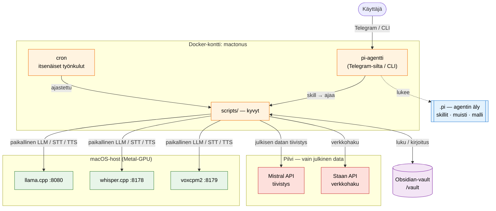

# Mactonus

**Mactonus** on tekoälyagentin paikallinen **kyvykkyyskerros**: keho ja työkalut, jotka pyörivät omalla raudallasi. Agentin äly (pi) on erillinen, **vaihdettava** komponentti — tämä repo on itse kyvyt ja niiden orkestrointi: litterointi, kuva-analyysi, sisällön tiivistäminen, verkkohaku, etäkomennot, kotiautomaatio ja Obsidian-vaultin ylläpito. Osa kyvyistä on agentin skillien kutsuttavissa, osa pyörii itsenäisesti ajastettuna ilman agenttia.

Yksityinen data käsitellään paikallisilla malleilla — ei mene ulos. Julkisen datan tiivistys voi käyttää nopeaa **Mistral-pilvimallia** (valinnainen, vaatii `MISTRAL_API_KEY`:n). Paikallinen LLM-, litterointi- ja TTS-inferenssi pyörii hostilla Metal-kiihdytyksellä.

## Yleisarkkitehtuuri



**Keskeinen periaate:** llama.cpp, whisper.cpp ja VoxCPM2 pyörivät **hostilla**, eivät kontissa, koska Docker Desktop ei läpäise Metal-GPU:ta. Kontissa pyörii vain orkestrointi (cron + Python + pi). Konttisisäiset skriptit kutsuvat hostin palveluja `host.docker.internal`-osoitteen kautta.

## Agentti, skillit ja skriptit

Osaa työnkuluista ohjaa **pi-agentti** (pi-coding-agent), joka pyörii kontissa. Telegram-silta (`telegram/telegram_silta.py`) ajaa pi:tä headless: käyttäjän viestit menevät pi:lle, ja viesteissä olevat linkit käsitellään deterministisesti jo ennen pi:tä (YouTube-litterointi, verkkosivutiivistys). pi:tä voi ajaa myös interaktiivisesti: `docker exec -it mactonus pi`.

Agentti ja koodi on eriytetty **kahteen git-repoon**:

- **`mactonus/` (tämä repo — koodi):** kaikki suoritettava kyky asuu `scripts/`:ssä. Sama skripti palvelee niin cronia kuin agentin skilliäkin. Jaetut moduulit (`config.py`, `mistral_apu.py`, `verkko_apu.py`, `tiedosto_apu.py`) ovat `scripts/`-juuressa.
- **`.pi/` (erillinen repo — agentti):** agentin skillit, muisti, persoona ja malliasetukset.

**Periaate — "skillit kuvaavat, skriptit tekevät":** skill on ohut `SKILL.md`-osoitin, joka kertoo agentille *milloin* ja *minkä* `scripts/`-skriptin ajaa; suoritettava logiikka asuu aina `scripts/`:ssä. Näin sama kyky toimii agentista riippumatta (cron, käsin tai vaikka toinen agentti).

## Kontekstin kompaktointi (pi ↔ llama.cpp)

pi lähettää koko keskusteluhistorian joka pyynnöllä. llama.cpp **ei** katkaise liian isoa promptia — se hylkää 400:lla ([llama.cpp#17284](https://github.com/ggml-org/llama.cpp/issues/17284)) toisin kuin Ollama, joka katkaisi hiljaa palvelinpuolella. `scripts/kompaktointi_valipalvelin.py` on **oma kompaktointikerroksemme**: ohut proxy (Python-stdlib, ei riippuvuuksia) pi:n ja llama.cpp:n välissä, joka pitää promptin konteksti-ikkunassa:

- **laskee** promptin koon tarkasti llama.cpp:n `/apply-template` + `/tokenize`:lla (chat-template + tools mukaan; fallback: sisältö × `KERROIN`, ettei aliarvioida),
- **leikkaa** promptin hystereesillä: kun se ylittää `YLA_OSUUS` (oletus 70 %) ikkunasta, kompaktoi kunnes alle `ALA_OSUUS` (oletus 40 %) — tiivistää vanhimman viestin ~3 lauseeseen (rullaava tiivistys, cachettu) tai pudottaa sen; system- ja nykyinen viesti säilyvät. Iso pudotus alarajaan antaa pelivaraa usealle vuorolle → tiivistys ei aja joka pyynnöllä,
- kirjoittaa vastauksen `finish_reason: length → stop`, jottei pi näytä katkennutta vastausta virheenä,
- striimaa SSE:n ja päättää sen siististi ([DONE]/EOF/idle) → ei jäätymistä.

Ajetaan kontissa pi:n rinnalle; pi osoittaa siihen (`.pi/models.json` `baseUrl` → `127.0.0.1:8081`, proxy välittää `host.docker.internal:8080`:aan). Vaatii llama.cpp:n yhdellä slotilla (`--parallel 1`), jotta koko ikkuna on per pyyntö.

```bash
docker exec -d mactonus python3 /root/scripts/kompaktointi_valipalvelin.py   # -it näyttää lokit
```

**Väliaikainen kerros:** tämä paikkaa sen, ettei pi:n oma compaction vielä toimi luotettavasti. Kun se korjautuu, kerroksen voi kytkeä pois: pi:n `baseUrl` takaisin :8080:aan (tai `TIIVISTA=0` pelkkään pudotukseen). Säädöt env:llä: `YLA_OSUUS` (0.7), `ALA_OSUUS` (0.4), `TIIVISTA`, `TIIVISTE_MIN`, `KONTEKSTI`.

Huom: pi:n oma konteksti-indikaattori (esim. `87.5%/33k`) **ei laske** kompaktoinnista — se mittaa pi:n omaa täyttä historiaa, jonka pi lähettää joka pyynnöllä. Leikkaus tapahtuu pi:n takana (proxy → llama.cpp), joten sen näkee vain proxyn lokista (`sovitus: tiivistetty N …`), ei pi:n mittarista.

## Työnkulut

Kunkin työnkulun **tarkempi toiminta ja kuvaaja** on sen oman kansion READMEssä (linkit alla).

| Työnkulku | Laukaisin | Skripti(t) | Malli | Syöte → Tuloste |
|---|---|---|---|---|
| [Nauhoitus + litterointi](scripts/litterointi/) | manuaalinen (host) | `litterointi/nauhoita_ja_litteroi.sh` + `litteroi_istunto.sh` | whisper large-v3-turbo | mikki → `.md` Obsidianiin |
| [Yksittäinen wav](scripts/litterointi/) | manuaalinen (host) | `litterointi/litteroi_wav.sh` | whisper large-v3-turbo | `.wav` → `.txt` |
| [Kuva-analyysi](scripts/kuvat/) | cron 15 min (kontti) | `kuvat/analysoi_kuvat.sh` → `enkoodaa_kuva.py` | `MALLI_KUVAT` | kuva `**/Liitteet/`:ssä → `*_teksti.md` + linkit viereisiin md-tiedostoihin |
| [Kuvatekstien jalostus](scripts/kuvat/) | cron 5 min (kontti) | `kuvat/jalosta_kuvatekstit.py` | `MALLI_TEKSTIT` | `*_teksti.md` joissa `#siisti-kuvailutulkkaus` → siistitty kuvaus + avainsanat |
| [Obsidian-notejen siistiminen](scripts/siistiminen/) | cron 1 min (kontti) | `siistiminen/siisti_muistiinpanot.py` | `MALLI_TEKSTIT` | `*[siisti]*`-merkitty `.md` → korvattu sisältö |
| [Transkriptien siistiminen](scripts/siistiminen/) | manuaalinen (kontti) | `siistiminen/siisti_transkriptit.py [prompt]` | `MALLI_TEKSTIT` | `*[siisti]*`-merkitty `Nauhoitukset/*.md` + valittu prompt → `*_<prompt>.md` |
| [Kommentointi](scripts/kommentointi/) | manuaalinen (kontti) | `kommentointi/kommentoija.py` + VoxCPM2 | `MALLI_KOMMENTOIJA` | aktiivinen nauhoitusistunto → puhuttu kommentti |
| [YouTube-tiivistys](scripts/youtube/) | pi / manuaalinen (kontti) | `youtube/lataa_transkriptio.sh` → `tiivista_youtube.py` | **Mistral** | YouTube-linkki → litterointi + suomenkielinen tiivistelmä `Clippings/YouTube/` |
| [Verkkosivu-tiivistys](scripts/verkkosivu/) | pi / manuaalinen (kontti) | `verkkosivu/tallenna_verkkosivu.py` | **Mistral** | URL (robots.txt huomioiden) → tiivistelmä `Clippings/Verkkosivutiivistelmät/` |
| [PDF-tiivistys](scripts/pdf/) | pi / manuaalinen (kontti) | `pdf/tallenna_pdf.py` (pdftotext) | **Mistral** | PDF (URL tai vault-polku) → tiivistelmä `Clippings/PDF-tiivistelmät/` |
| [EU digital sovereignty -daily](scripts/eu_digital_sovereignty/) | cron (kontti) | `eu_digital_sovereignty/paivittain.py` | **Mistral** (tiivistys) + `MALLI_TEKSTIT` (valinta/tulkinta) | Staan-verkkohaku → Telegram-digesti + arkisto `Clippings/Staan/` |
| [Telegram-silta](scripts/telegram/) | jatkuva (kontti) | `telegram/telegram_silta.py` | pi-agentti | Telegram-viestit → pi; linkit käsitellään determ. ennen pi:tä |

(Lisäksi `kommentointi/sano.py` on yksinkertainen TTS-asiakas debugointiin, ei oma työnkulku. Julkisen datan tiivistys käyttää Mistralia; yksityinen vault-data käsitellään paikallisilla `MALLI_*`-malleilla.)

## Pikakäynnistys

### Esivaatimukset

- macOS Apple Silicon (Metal-tuki — llama.cpp ja whisper.cpp käyttävät GPU:ta)
- [Homebrew](https://brew.sh) — pakettienhallinta `brew install`-komentoja varten
- [Docker Desktop](https://docker.com/products/docker-desktop/) — `mactonus`-kontti pyörii sen päällä
- [Obsidian](https://obsidian.md) + vault-hakemisto johonkin

### 1. Asenna riippuvuudet

```bash
brew install whisper-cpp   # whisper-server + whisper-cli
brew install sox           # rec-komento nauhoitukseen
brew install llama.cpp     # LLM-runtime (tarjoaa llama-server / llama serve)
```

### 2. Lataa LLM-malli

Yksi multimodaali malli hoitaa sekä tekstin että kuva-analyysin. `-hf` noutaa GGUF:n ja
vision-projektorin (mmproj) automaattisesti annettuun kansioon — anna latautua ja sammuta (Ctrl-C):

```bash
mkdir -p ~/llama-models
LLAMA_CACHE=~/llama-models llama serve -hf unsloth/Qwen3.6-35B-A3B-MTP-GGUF:Q5_K_M --port 8080
```

`Q5_K_M` on ~25 GB. Malli on MoE (~3B aktiivista per token) → nopea ajossa; MTP antaa lisänopeutta
(sisäänrakennettu speculative decoding). 48 GB RAM riittää tähän + whisper + VoxCPM2 yhtä aikaa.
Pienempää tarvittaessa: vaihda quant `:Q4_K_M` (~20 GB).

### 3. Lataa whisper-malli

```bash
mkdir -p conf/whisper-models
curl -L -o conf/whisper-models/ggml-large-v3-turbo.bin \
    https://huggingface.co/ggerganov/whisper.cpp/resolve/main/ggml-large-v3-turbo.bin
```

### 4. Konfiguroi `.env`

```bash
cp .env.example .env
```

Aseta vähintään `VAULT_HOST_PATH` (Obsidian-vaultin absoluuttinen polku) ja `MALLI_*`-arvot kohdasta 2. Muut säädöt toimivat oletuksilla. Julkisen datan tiivistys (YouTube/verkkosivu/PDF/EU-daily) vaatii lisäksi `MISTRAL_API_KEY`:n; valinnaiset `STAAN_API_KEY` (EU-daily) ja `TELEGRAM_BOT_TOKEN` (Telegram-silta) ohjeineen `.env.example`:ssä.

### 5. Luo kehotetiedostot vaultiin

Skriptit lukevat kehotteet vaultista ajonaikaisesti. Luo nämä `.md`-tiedostot ennen ensimmäistä ajoa — sisältö on prompt LLM:lle:

| Tiedosto | Käyttäjä | Pakollinen? |
|---|---|---|
| `<vault>/mactonus/Kehotteet/Analysoi kuva.md` | `enkoodaa_kuva.py` (kuva-analyysi) | optionaali — falbackaa inline-defaulttiin |
| `<vault>/mactonus/Kehotteet/Kommentoija.md` | `kommentoija.py` (kommentointi) | **pakollinen** kommentointiin |
| `<vault>/mactonus/Dokumenttimuoto-kehotteet/<nimi>.md` | `siisti_transkriptit.py [nimi]` | **pakollinen** annetulle prompt-nimelle |

`siisti_muistiinpanot.py`:n kehote on inline-koodissa eikä vaadi tiedostoa.

### 6. Puhesynteesi-palvelin (TTS) äänikommentointia varten

Kommentointi-työnkulku (`kommentointi/kommentoija.py` + `sano.py`) käyttää host-puolen TTS-palvelinta
`scripts/puhesynteesi/` (VoxCPM2, portti 8179). Asenna venv ja riippuvuudet:

```bash
cd scripts/puhesynteesi
python3.12 -m venv .venv
source .venv/bin/activate
pip3 install voxcpm soundfile requests numpy
```

Nauhoita äänireferenssi kerran (`python3 nauhoita_aani.py`) ja aseta sen nimi `.env`:hen
(`VOXCPM_REFERENSSI`). Ks. [`scripts/puhesynteesi/`](scripts/puhesynteesi/). Palvelimen
käynnistys on kohdassa 7.

### 7. Käynnistä palvelut

Neljä terminaalia. A jää auki missä tahansa, B–D ajetaan mactonus-juuressa:

```bash
# A. llama.cpp LLM-runtime — :8080 (jää auki)
# Single-model-moodi (-m): malli pysyy ladattuna, vision toimii, ei pientä payload-rajaa.
MODEL=$(find ~/llama-models -iname '*Q5_K_M*.gguf' | head -1)
MMPROJ=$(find ~/llama-models -iname 'mmproj*.gguf' | head -1)
llama serve -m "$MODEL" --mmproj "$MMPROJ" \
    --image-min-tokens 1024 -fa on --host 0.0.0.0 --port 8080

# B. whisper.cpp server — :8178 (jää auki)
bash scripts/litterointi/whisper_palvelin.sh

# C. Puhesynteesi-palvelin (VoxCPM2) — :8179 (jää auki)
cd scripts/puhesynteesi
source .venv/bin/activate
python3 voxcpm2_palvelin.py

# D. mactonus-kontti
docker compose up -d --build
```

llama serve -liput:
- `--host 0.0.0.0` — sitoutuu kaikkiin verkkointerface-osoitteisiin niin että `host.docker.internal:8080` toimii kontista varmasti (default `127.0.0.1` voi jäädä kontille tavoittamattomiin riippuen Dockerin verkkotilasta).
- `--mmproj` — vision-projektori; pakollinen kuva-analyysiin.
- `--image-min-tokens 1024` — riittävä kuvaresoluutio Qwen-VL:lle (muuten malli "arvaa" eikä näe kuvaa kunnolla).
- `-fa on` — Flash Attention, nopeus + muistinsäästö.

Single-model-moodissa malli pysyy ladattuna koko ajon — ei cold-load-kiertoa cron-ajojen välillä,
toisin kuin malleja idle-aikana purkavilla runtimeilla.

Kontti tavoittaa hostin palvelimet (llama.cpp, whisper, VoxCPM2) `host.docker.internal`-osoitteen kautta — ei tarvetta säätää portteja erikseen.

Nauhoituksen ajokomennot: ks. [`scripts/litterointi/`](scripts/litterointi/).

## Hakemistorakenne

```
mactonus/
├── Dockerfile                 # kontti-image: cron + Python + Node/pi + poppler-utils
├── docker-compose.yml         # mount /vault + .pi + extra_hosts host.docker.internal
├── scripts/
│   ├── config.py              # MALLI_*, LLM_*, WHISPER_*, VOXCPM_*, MISTRAL_* — keskitetty
│   ├── llm_apu.py             # jaettu: LLM-kutsu (OpenAI /v1/chat/completions, teksti + kuva)
│   ├── mistral_apu.py         # jaettu: Mistral-kutsu + tiivistyskehote + frontmatter-muoto
│   ├── verkko_apu.py          # jaettu: robots + haku + HTML→teksti + meta
│   ├── tiedosto_apu.py        # jaettu: tiedostonimien siistiminen (säilyttää ääkköset)
│   ├── kompaktointi_valipalvelin.py  # pi↔llama.cpp: pitää promptin konteksti-ikkunassa
│   ├── litterointi/           # HOST: nauhoitus + whisper              → README
│   ├── kuvat/                 # KONTTI cron: kuva-analyysi             → README
│   ├── siistiminen/           # KONTTI: muistiinpanot + transkriptit   → README
│   ├── kommentointi/                  # KONTTI: kommentointi (TTS-asiakas)      → README
│   ├── puhesynteesi/          # HOST: VoxCPM2 TTS-palvelin (:8179)      → README
│   ├── youtube/               # tiivistys (Mistral)                    → README
│   ├── verkkosivu/            # tiivistys (Mistral)                    → README
│   ├── pdf/                   # tiivistys (Mistral, pdftotext)         → README
│   ├── eu_digital_sovereignty/ # cron: Staan + Mistral daily           → README
│   ├── telegram/              # pi-silta                               → README
│   ├── lamppu/ ssh/ staan/ tilauspalvelu/      # agentin skill-skriptit (kuvattu .pi:n SKILL.md:issä)
│   └── aihe_seuraaja/ cron/ muisti/ pi_vault_sync/ yhteenveto/  # muut työnkulut
├── conf/
│   ├── cron/                  # cron-tiedostot (bind-mount /etc/cron.d/:hen)
│   └── whisper-models/        # ggml-*.bin (gitignore)
├── .pi/                       # erillinen repo: agentin äly (skillit/muisti/malli) — gitignore
└── logs/                      # cron-ajojen tulosteet (host-mount)
```

## Polkuhuomioita

Skriptit viittaavat **konttisisäisiin** polkuihin (`/vault`, `/root/scripts/<työnkulku>/...`). Host-puolella nämä ovat Obsidian-vault ja `mactonus/scripts/`. Kontti ↔ host -mapit `docker-compose.yml`:ssä.

`scripts/litterointi/`-kansion skriptit ajetaan nativisti hostilla — ne olettavat `/opt/homebrew/bin/rec`, `/opt/homebrew/bin/sox` ja `whisper-server` PATHissa. Niiden väliset polut ratkaistaan `BASH_SOURCE`:n kautta, joten repo voi olla missä tahansa host-kansiossa.

## Konfiguraatio

Pysyvä infra (URL:t, portit, timeoutit) on `scripts/config.py`:ssä. Usein vaihtuvat arvot (mallit, vault-polku, äänireferenssi) ja salaisuudet (API-avaimet, tokenit) tulevat `.env`-tiedostosta — kopioi `.env.example` → `.env` ja täytä `VAULT_HOST_PATH`. Python-skriptit `from config import ...`; bash-skriptit `eval "$(python3 ../config.py)"`. Älä hajauta arvoja takaisin skripteihin, äläkä kovakoodaa salaisuuksia (tämä repo on julkinen) — ne tulevat aina `.env`:stä.
