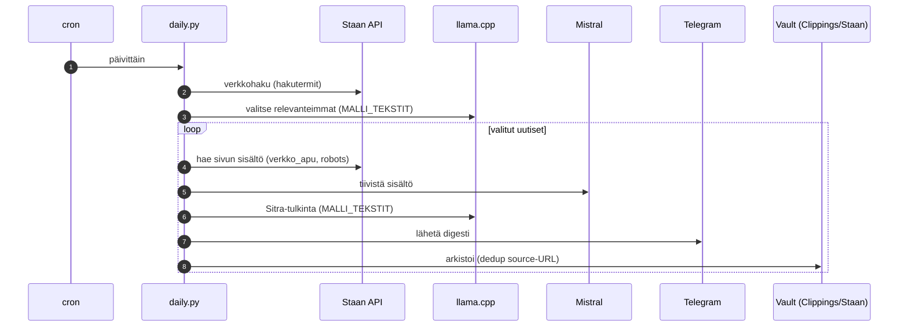

# EU digital sovereignty — daily

Cron-työnkulku: hakee EU:n digitaaliseen suvereniteettiin ja paikallisiin tekoälymalleihin liittyviä uutisia (Staan-verkkohaku), valitsee relevanteimmat, lukee ja tiivistää sisällön, tulkitsee Sitran näkökulman, lähettää Telegram-digestin ja arkistoi vaultiin.

## Mallien jako

- **Sivun tiivistys → Mistral** (julkista dataa, nopea pilvi).
- **Uutisten valinta + Sitra-tulkinta → paikallinen llama.cpp** (`MALLI_TEKSTIT`) — Sitra-spesifistä päättelyä, ei ulkoisteta.
- **Kaavinta** jaettu verkkosivu-tiivistyksen kanssa (`verkko_apu.py`).

Vaatii `STAAN_API_KEY`:n ja (tiivistykseen) `MISTRAL_API_KEY`:n. Arkisto toimii dedup-lähteenä: jo lähetettyjä URL:eja ei valita uudestaan.
