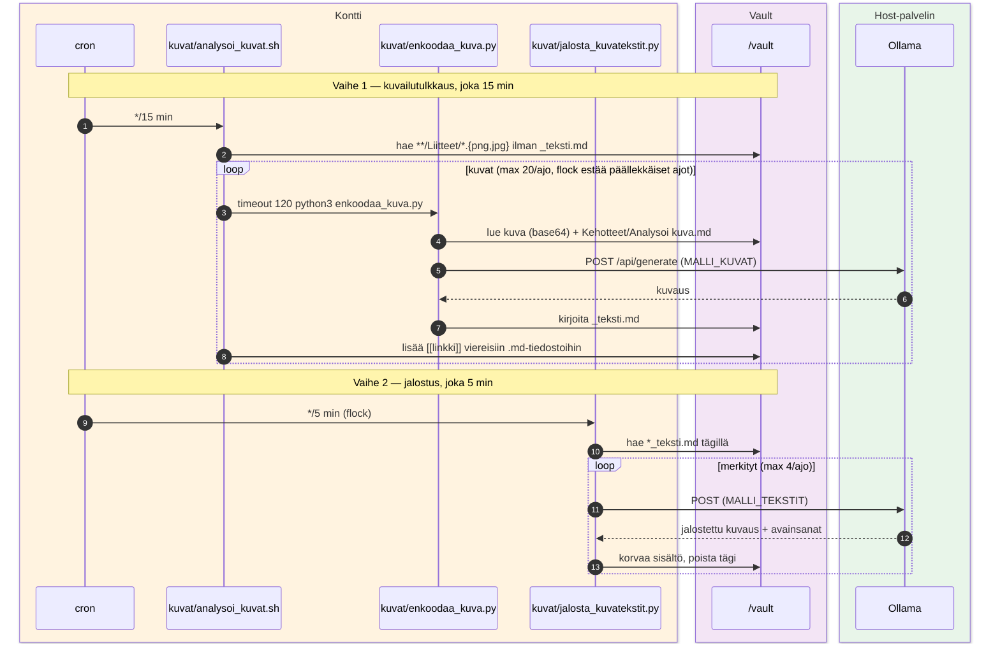

# Kuva-analyysi — kuvailutulkkaus + jalostus

Cron-pohjainen työnkulku kontissa: löytää vaultin `**/Liitteet/`-kuvat, tuottaa kuvauksen (Ollama `MALLI_KUVAT`), linkittää viereisiin muistiinpanoihin, ja jalostaa erikseen merkityt kuvatekstit.

## Skriptit

- `analysoi_kuvat.sh` — cron-wrapper (flock), max 20 kuvaa/ajo
- `enkoodaa_kuva.py` — kuva (base64) + kehote → `MALLI_KUVAT` → `*_teksti.md`
- `jalosta_kuvatekstit.py` — `#siisti-kuvailutulkkaus`-merkityt → `MALLI_TEKSTIT` → siistitty kuvaus + avainsanat

Kuva-analyysin kehote: `<vault>/mactonus/Kehotteet/Analysoi kuva.md` (valinnainen, fallback inline-defaulttiin).
