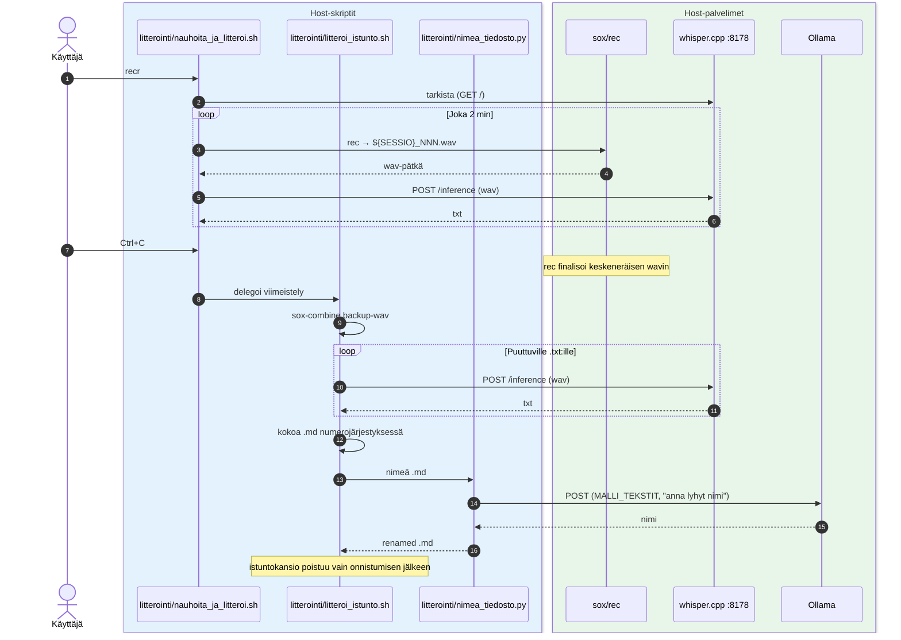

# Litterointi — nauhoitus + whisper (host)

Nauhoitus ja litterointi pyörivät **hostilla** (eivät kontissa): `rec`/`sox` äänen kaappaukseen ja whisper.cpp litterointiin. Skriptit kutsuvat hostin whisper-palvelinta (`:8178`) ja Ollamaa (tiedoston nimeämiseen).



## Ajaminen

```bash
# Nauhoitus (Ctrl+C lopettaa ja viimeistelee)
bash scripts/litterointi/nauhoita_ja_litteroi.sh

# Viimeistele keskeytynyt istunto käsin (wavit tmp_chunks/$SESSIO/:ssä)
bash scripts/litterointi/litteroi_istunto.sh 2026-04-23_17-50-47

# Litteroi yksittäinen valmis wav
bash scripts/litterointi/litteroi_wav.sh /polku/tiedostoon.wav
```

## Skriptit

- `whisper_palvelin.sh` — käynnistää whisper.cpp-palvelimen (`:8178`)
- `nauhoita_ja_litteroi.sh` — 2 min wav-pätkät + live-litterointi taustalla
- `litteroi_istunto.sh` — istunnon viimeistely: backup-wav, puuttuvat litteroinnit, kokoaa `.md`:n, nimeää
- `litteroi_wav.sh` — yksittäinen valmis wav → `.txt`
- `nimea_tiedosto.py` — AI-pohjainen `.md`:n uudelleennimeäminen (Ollama)

Host-binäärit: `/opt/homebrew/bin/{rec,sox}` ja `whisper-server` PATHissa. Skriptien väliset polut ratkaistaan `BASH_SOURCE`:n kautta, joten repo voi olla missä tahansa host-kansiossa.
