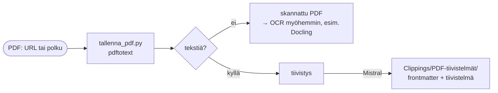

# PDF-tiivistys

PDF (URL tai vault-polku) → teksti (`pdftotext`) → suomenkielinen tiivistelmä (Mistral) → `Clippings/PDF-tiivistelmät/<otsikko>.md`.

## Skriptit

- `tallenna_pdf.py` — purkaa tekstin (`pdftotext`), tiivistää (Mistral), tallentaa

URL:n tapauksessa PDF **ladataan ja URL merkitään lähteeksi** (ei `/tmp`-polkua). Vaatii `poppler-utils` (asennettu Dockerfilessä).

## Rajaukset

Skannatut/kuvapohjaiset PDF:t eivät tuota tekstiä `pdftotext`illä → niihin tarvitaan OCR. Luonteva päivityspolku on [Docling](https://github.com/docling-project/docling) (OCR + layout + taulukot).

## Jaettu logiikka

Tiivistys + muotoilu (`mistral_apu.py`) jaetaan **YouTube-** ja **verkkosivu-tiivistyksen** kanssa, sama frontmatter-muoto. Alkuperäistä sisältöä ei säilytetä.
