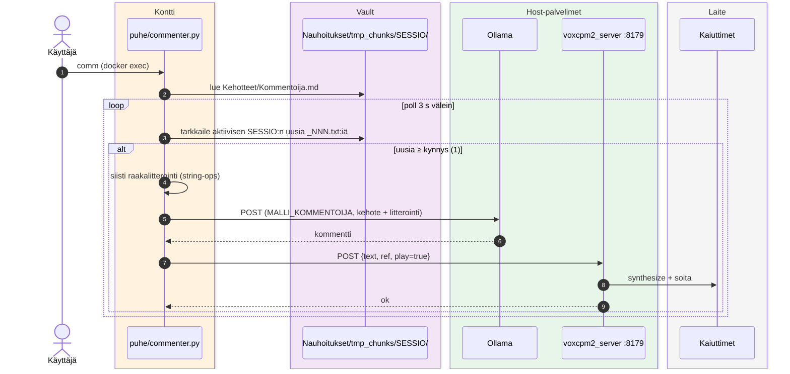

# Kommentointi — VoxCPM2-pohjainen ääniagentti

Reaaliaikainen ääniagentti: seuraa käynnissä olevaa nauhoitusistuntoa, tuottaa puhutun kommentin (Ollama `MALLI_KOMMENTOIJA`) ja syntetisoi sen ääneksi (VoxCPM2 `:8179`).

## Skriptit

- `commenter.py` — kuuntelee aktiivista istuntoa ja kommentoi (`comm` = docker exec)
- `say.py` — yksinkertainen TTS-asiakas debuggaukseen (`host.docker.internal:8179`)

Vaatii kehotteen `<vault>/mactonus/Kehotteet/Kommentoija.md` ja käynnissä olevan VoxCPM2-palvelimen ([`paikallinen-puheassistentti`](https://github.com/atonusgit/paikallinen-puheassistentti)).
