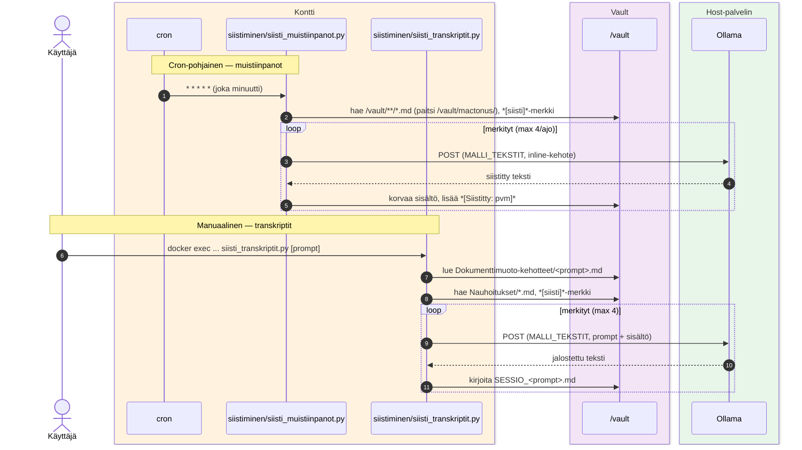

# Tekstien siistiminen — muistiinpanot + transkriptit

Kaksi siistimistyönkulkua: cron-pohjainen muistiinpanojen siistiminen ja manuaalinen transkriptien jalostus valitulla dokumenttimuoto-kehotteella.

## Skriptit

- `siisti_muistiinpanot.py` — `*[siisti]*`-merkityt `/vault/**/*.md` (cron 1 min); kehote inline-koodissa
- `siisti_transkriptit.py [prompt]` — `Nauhoitukset/*.md` + valittu `Dokumenttimuoto-kehotteet/<prompt>.md` (manuaalinen)
