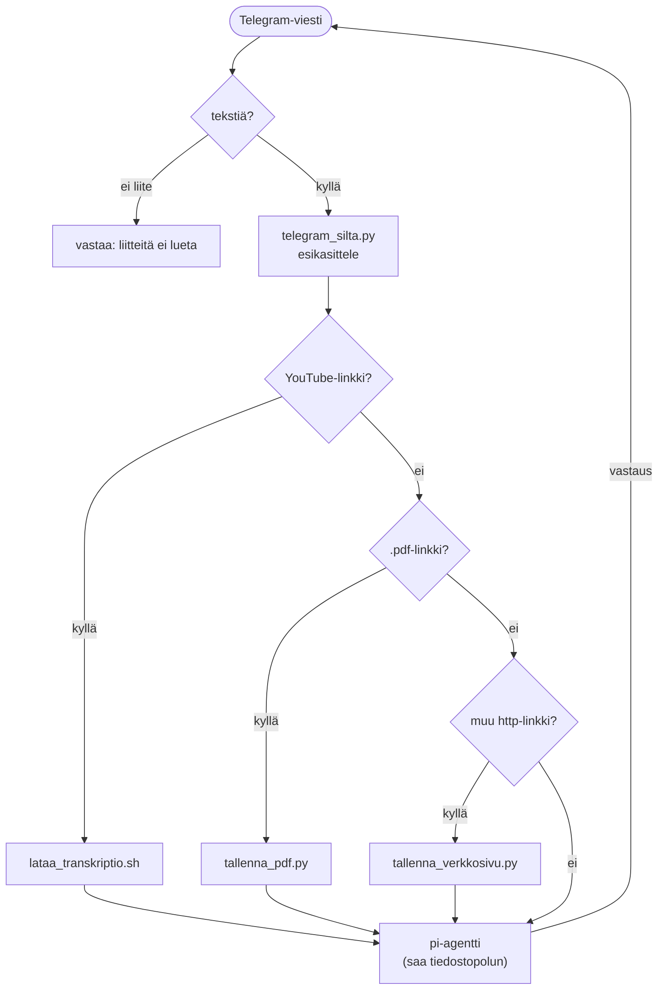

# Telegram-silta

Ajaa **pi-agenttia** headless Telegramin yli: käyttäjän viestit menevät pi:lle, ja viesteissä olevat linkit käsitellään **deterministisesti ennen pi:tä**. pi saa tulokseksi tiedostopolun (ei koko sisältöä → ei kontekstin räjäytystä).

## Toiminta

- Vain `TELEGRAM_SALLITUT_CHATIT`-listan chatit pääsevät läpi (pi voi ajaa bashia ja kirjoittaa vaultiin).
- Linkkien deterministinen käsittely tapahtuu ennen pi:tä → johdonmukainen lopputulos, ei agentin improvisointia. Reititys: YouTube → litterointi, `.pdf`-URL → PDF-tiivistys, muu http(s) → verkkosivutiivistys.
- **Liitetiedostoja ei vielä lueta** — teksitön viesti (esim. PDF tiedostona) saa vastauksen siitä, ei hiljaista ohitusta. PDF kannattaa jakaa **linkkinä**.
- **Ajattelutaso per chat**: pi:n thinking (reasoning) välitetään `--thinking`-lipulla ja säilyy chatkohtaisesti (`ajattelu_tasot.json`), oletus pois (nopeat vastaukset). Vaihdetaan komennoilla (ks. alla).
- **"🧠 Miettii…"** ilmestyy kun malli oikeasti tuottaa reasoning-sisältöä — aito indikaattori, ei placeholder.
- **Työkalukutsut yhdessä viestissä**: otsikko "🔧 Työkalut (N)" + kutistettava `expandable`-blockquote, jota päivitetään paikallaan (`editMessageText`) joka työkalulla. Ei viestitulvaa, ja koko historia säilyy napautuksen takana. Vaimennettavissa `KERRO_TYOKALUT=0`.
- pi:tä voi ajaa myös interaktiivisesti ilman siltaa: `docker exec -it mactonus pi`.

## Komennot

Chatissa (koko viesti = komento, ellei toisin mainita):

| Komento | Toiminto |
|---|---|
| `/uusi` (myös `/reset`, `/nollaa`, `uusi keskustelu`) | Aloittaa uuden keskustelun (tuore pi-sessio). |
| `/ajattele`, `/mieti` | Kytkee ajattelun (thinking) päälle chatille. Voi antaa kysymyksen samassa: `/ajattele <kysymys>`. |
| `/nopea`, `/pika` | Kytkee ajattelun pois (nopeat vastaukset). Oletus. |

## Kytkimet (`.env`)

`TELEGRAM_BOT_TOKEN` (tyhjä → silta ei käynnisty), `TELEGRAM_SALLITUT_CHATIT`, `YOUTUBE_LATAUS`, `VERKKOSIVU_TALLENNUS`, `KERRO_TYOKALUT`, `KERRO_LAHETTAJA`.
