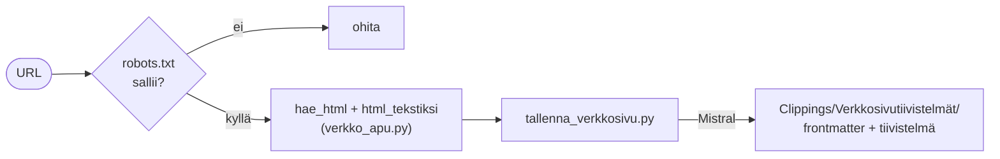

# Verkkosivu-tiivistys

URL → robots.txt-tarkistus → haku + HTML→teksti → suomenkielinen tiivistelmä (Mistral) → `Clippings/Verkkosivutiivistelmät/<otsikko>.md`.

## Skriptit

- `tallenna_verkkosivu.py` — robots-tarkistus, haku, HTML→teksti, tiivistys, tallennus

## Jaettu logiikka

- **Kaavinta** (`verkko_apu.py`): `sivu_sallittu` (robots), `hae_html`, `html_tekstiksi`, `etsi_otsikko`, `etsi_julkaisija`, `etsi_julkaisupvm` — jaettu **EU-daily**:n kanssa.
- **Tiivistys + muotoilu** (`mistral_apu.py`): jaettu **YouTube-** ja **PDF-tiivistyksen** kanssa, sama frontmatter-muoto. Alkuperäistä sisältöä ei säilytetä.
