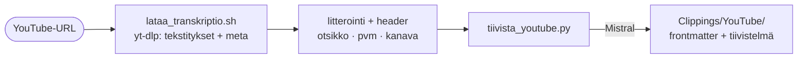

# YouTube-tiivistys

YouTube-linkki → litterointi (yt-dlp:n tekstitykset) → suomenkielinen tiivistelmä (Mistral) → `Clippings/YouTube/<otsikko>.md`.

## Skriptit

- `lataa_transkriptio.sh` — hakee tekstitykset ja metatiedot (otsikko, julkaisupäivä, kanava)
- `tiivista_youtube.py` — tiivistää litteroinnin Mistralilla, kirjoittaa lopullisen frontmatter-muodon

## Jaettu logiikka

Tiivistys ja muotoilu jaetaan **verkkosivu-** ja **PDF-tiivistyksen** kanssa moduulissa `mistral_apu.py` (`kutsu_mistral`, `tiivistys_kehote`, `muotoile_tiivistelma`). Sama frontmatter-muoto (Lähde / Päiväys / Julkaisija + `# <Otsikko> -tiivistelmä`) kaikissa kolmessa. Litterointia itseään ei säilytetä — tiivistelmä on lopputuote.
